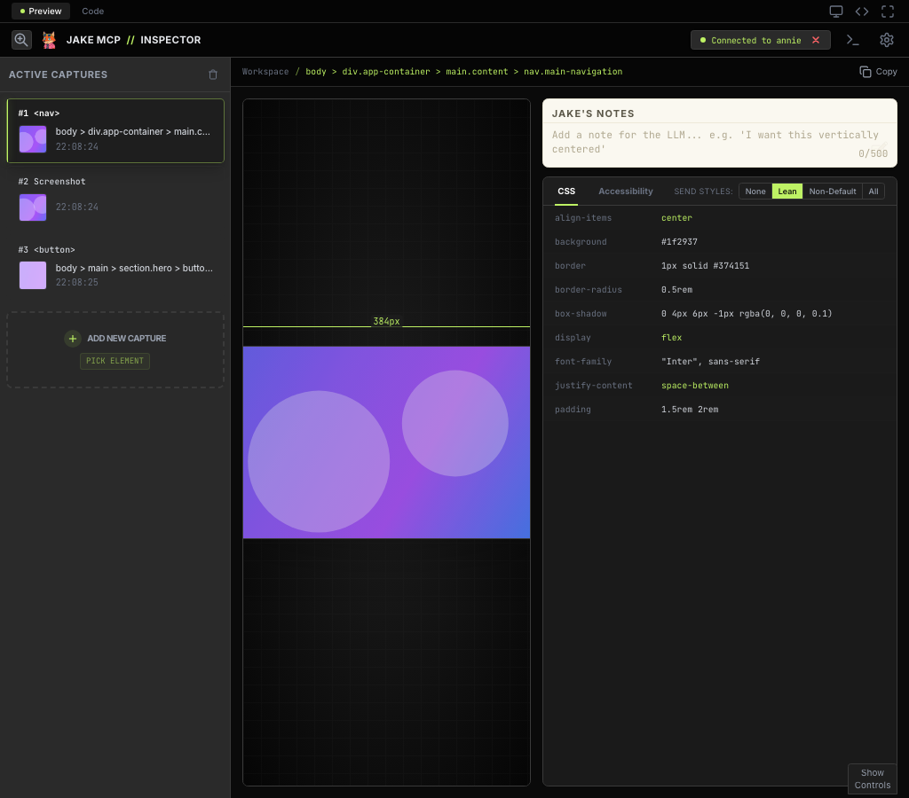
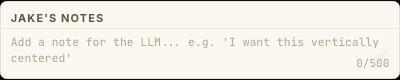
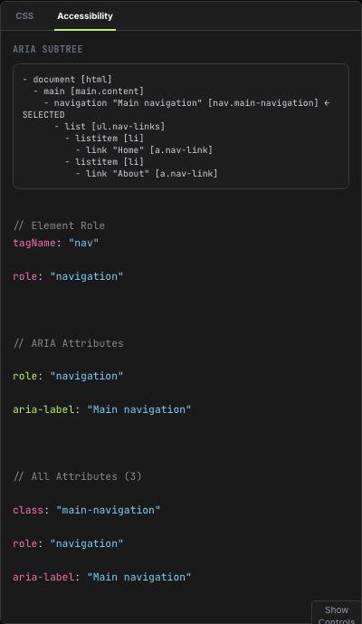
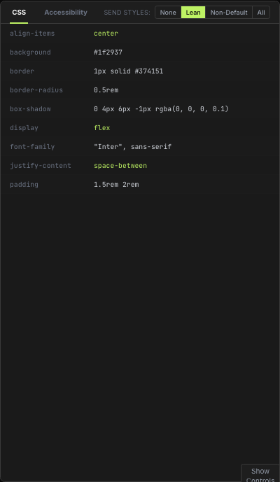
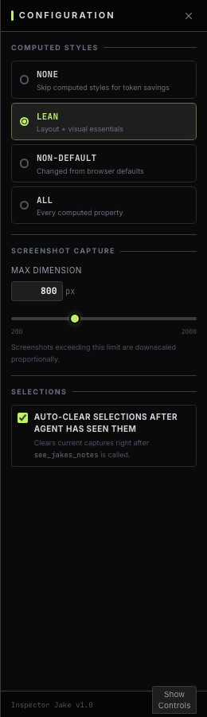

# Inspector Jake

Let AI agents inspect and interact with web pages through Chrome DevTools.

[](https://www.npmjs.com/package/inspector-jake-mcp)
[](LICENSE)

## What is Inspector Jake?

Inspector Jake is an MCP (Model Context Protocol) server that connects AI assistants like Claude to Chrome DevTools. Agents can inspect page structure via ARIA trees, capture screenshots, read console logs, monitor network requests, and interact with elements through clicks, typing, and navigation.

## Session Management

When the MCP server starts, it automatically picks an available session name and port. Use `get_session_info` to find out which session you're on, and `set_session_name` to switch.

### Getting the Session Name

The agent should call `get_session_info` at the start of a conversation to tell you which session to connect to in the Chrome extension:

```json
// Response from get_session_info
{
  "sessionName": "annie",
  "port": 52992,
  "browserConnected": true,
  "connectedTab": { "id": 123, "title": "My App", "url": "https://myapp.com" }
}
```

Open the Inspector Jake DevTools tab and connect to the session name shown above.

### Changing the Session Name

Use `set_session_name` to switch to a different session at runtime. Predefined names (`jake`, `annie`, `kevin`, `elsa`) are auto-discovered by the Chrome extension. Custom names work too — the response includes the port for manual connection.

```json
// Request
{ "name": "jake" }

// Response
{
  "message": "Switched session from \"annie\" to \"jake\"",
  "sessionName": "jake",
  "port": 52340,
  "previousName": "annie",
  "previousPort": 52992
}
```

After switching, re-scan sessions in the Chrome extension and connect to the new name. The previous browser connection is dropped.

## DevTools Panel



The Inspector Jake DevTools panel is your workspace for capturing elements, annotating them for the AI agent, and reviewing computed styles and accessibility trees.

### Jake's Notes



Pin elements or drag to capture regions, then add notes for the AI agent. Notes appear as context when the agent calls `see_jakes_notes`. Use them for requests like *"make this button bigger"*, *"fix the alignment here"*, or *"this color is wrong"*.

### Why ARIA Trees Instead of Raw HTML



Inspector Jake uses ARIA accessibility trees instead of raw HTML for page inspection. Raw HTML is too verbose and noisy for LLM context windows. ARIA trees are a compact, semantic representation — roles, names, and states capture what the user sees and can interact with. Each element gets a ref (e.g., `s1e42`) that maps directly to interaction tools like `click_element` and `type_into_element`.

### Computed Styles & Send Styles



The CSS panel shows computed styles for selected elements. The **Send Styles** setting controls how much CSS context the agent receives when it reads selections:

- **None** — Skip computed styles entirely (saves tokens)
- **Lean** — Layout + visual essentials (display, flex, padding, colors, fonts)
- **Non-Default** — Only properties changed from browser defaults
- **All** — Every computed property (most verbose)

### Configuration



- **Computed Styles** — Choose how much CSS context to send (None / Lean / Non-Default / All)
- **Screenshot Capture — Max Dimension** — Screenshots exceeding this limit (200–2000px, default 800) are downscaled proportionally
- **Auto-clear Selections** — Clears captures automatically after the agent reads them via `see_jakes_notes`

## Architecture

```
┌─────────────────┐                    ┌─────────────────────┐
│   AI Agent      │───MCP Protocol────▶│   MCP Server        │
│ (Claude, etc)   │                    │   inspector-jake    │
└─────────────────┘                    └──────────┬──────────┘
                                                  │ WebSocket
                                                  ▼
                                       ┌─────────────────────┐
                                       │  Chrome Extension   │
                                       │  (connected tab)    │
                                       └──────────┬──────────┘
                                                  │
                                                  ▼
                                       ┌─────────────────────┐
                                       │  DevTools Panel     │
                                       │  (element tracking) │
                                       └─────────────────────┘
```

## Quick Start

### 1. Install the MCP Server

```bash
npx inspector-jake-mcp
```

### 2. Configure Your MCP Client

For Codex CLI, use Codex's MCP manager with the npm package directly:

```bash
# 1) Add Inspector Jake MCP server to Codex
codex mcp add inspector-jake -- npx -y inspector-jake-mcp@1.0.10

# 2) Verify it was added
codex mcp list
codex mcp get inspector-jake
```

Important: do not configure Codex with `command: inspector-jake-mcp` directly unless that binary is globally installed. Use `npx` as shown above.

If you see `No such file or directory (os error 2)`, re-add with the full `npx` path:

```bash
which npx
codex mcp remove inspector-jake
# Replace /opt/homebrew/bin/npx with the path printed by `which npx`
codex mcp add inspector-jake -- /opt/homebrew/bin/npx -y inspector-jake-mcp@1.0.10
```

For Claude Code (global, available in all projects):

```bash
claude mcp add --scope user --transport stdio inspector-jake -- npx -y inspector-jake-mcp
```

For Claude Code (project-scoped):

```bash
claude mcp add --transport stdio inspector-jake -- npx -y inspector-jake-mcp
```

For Claude Desktop, add to your config (`~/.config/claude/claude_desktop_config.json` on macOS/Linux):

```json
{
  "mcpServers": {
    "inspector-jake": {
      "command": "npx",
      "args": ["-y", "inspector-jake-mcp"]
    }
  }
}
```

For other MCP clients (generic stdio):

```json
{
  "inspector-jake": {
    "command": "npx",
    "args": ["-y", "inspector-jake-mcp"],
    "transport": "stdio"
  }
}
```

### Updating

If you configured your client with `npx -y inspector-jake-mcp` (no pinned version), you'll automatically get the latest version next time the server starts. No action needed.

If you pinned a version (e.g. `inspector-jake-mcp@1.0.10`), update the version number in your config or re-run the `mcp add` command with the new version.

If you installed globally:

```bash
npm update -g inspector-jake-mcp
```

### 3. Load the Chrome Extension

1. Open Chrome and go to `chrome://extensions/`
2. Enable "Developer mode" (toggle in top right)
3. Click "Load unpacked"
4. Select the `packages/chrome-extension/dist` folder

For Chrome Web Store upload, create a zip from inside `dist`:

```bash
cd packages/chrome-extension/dist
zip -r ../../../inspector-jake-chrome-store.zip .
```

Important: the zip must contain `manifest.json` at the root (not inside a top-level `dist/` folder).

### 4. Connect

1. Navigate to any webpage
2. Open DevTools (F12)
3. Click the "Jake" tab
4. Click "Connect" to your MCP session

## MCP Tools (17)

### Inspection

| Tool | Description |
|------|-------------|
| `get_page_info` | Page URL, title, viewport, and full ARIA accessibility tree with element refs |
| `get_session_info` | MCP session name, port, and browser connection status |
| `set_session_name` | Switch session to a different name and port at runtime |
| `see_jakes_notes` | All user-pinned selections from the DevTools panel |
| `view_image_in_jakes_notes` | View a stored selection image by its ID |
| `capture_screenshot` | Screenshot by element ref, CSS selector, or full page |
| `get_console_logs` | Console output and uncaught errors (log, warn, error, info, debug, trace, assert, exceptions) |
| `get_network_requests` | Captured fetch/XHR network requests with URL, method, status, headers, and timing |
| `run_javascript` | Execute JavaScript in the page context |

### Interaction

| Tool | Description |
|------|-------------|
| `click_element` | Click an element by ref or CSS selector |
| `type_into_element` | Type text into an input by ref or CSS selector |
| `select_dropdown_option` | Select an option from a `<select>` dropdown |
| `wait_for_element` | Wait until a CSS selector matches an element on the page |

### Navigation

| Tool | Description |
|------|-------------|
| `navigate_to_url` | Navigate the browser to a URL |
| `go_back` | Navigate back in browser history |
| `go_forward` | Navigate forward in browser history |
| `reload_page` | Reload the current page |

## Tool Examples

### get_page_info

Returns page metadata and an ARIA tree with interactive element refs (e.g., `s1e42`) that can be used with `click_element`, `type_into_element`, and other interaction tools.

**Response:**
```
Page: Example Page
URL: https://example.com
Viewport: 1920x1080

- navigation [s1e1|nav]
  - link "Home" [s1e2|a.nav-link]
  - link "About" [s1e3|a.nav-link:nth-of-type(2)]
- main [s1e4|main]
  - heading "Welcome" [level=1] [s1e5|h1]
  - textbox "Search" [s1e6|input#search]
  - button "Submit" [s1e7|button.btn]
```

### capture_screenshot

**Request:**
```json
{
  "selector": "#submit-btn"
}
```

Returns a base64-encoded PNG image of the matched element.

### click_element

**Request (by ref from get_page_info):**
```json
{
  "ref": "s1e7"
}
```

**Request (by CSS selector):**
```json
{
  "selector": "#submit-btn",
  "clickCount": 2
}
```

### get_console_logs

**Request:**
```json
{
  "types": ["error", "warn"],
  "clear": true
}
```

**Response:**
```json
{
  "logs": [
    {"type": "error", "message": "Uncaught TypeError: x is not a function", "timestamp": 1700000000000},
    {"type": "warn", "message": "Deprecated API usage", "timestamp": 1700000001000}
  ]
}
```

### get_network_requests

**Request:**
```json
{
  "urlPattern": "/api/",
  "method": "POST",
  "statusMin": 400,
  "clear": true
}
```

**Response:**
```json
{
  "requests": [
    {
      "url": "https://example.com/api/users",
      "method": "POST",
      "status": 422,
      "statusText": "Unprocessable Entity",
      "type": "fetch",
      "requestHeaders": { "content-type": "application/json" },
      "responseHeaders": { "content-type": "application/json" },
      "duration": 145,
      "timestamp": 1700000000000
    }
  ]
}
```

All parameters are optional. Omit them to get all captured requests. Captures fetch() and XMLHttpRequest traffic — does not include request/response bodies.

### run_javascript

**Request:**
```json
{
  "code": "document.title"
}
```

**Response:**
```json
{
  "result": "My App - Dashboard"
}
```

## Session Discovery

The extension discovers MCP servers using predefined session names (`jake`, `annie`, `kevin`, `elsa`), each mapped to a deterministic port via hash. When the MCP server starts, it picks the first available name and listens on its port. The extension scans all four ports to find active servers.

You can also switch to a custom session name at runtime using `set_session_name`. Custom names get a deterministic port but won't be auto-discovered by the extension — the agent will tell you the port number for manual connection.

## Development

### Prerequisites

- Node.js 18+
- npm 9+
- Chrome browser

### Setup

```bash
git clone https://github.com/inspectorjake/inspector-jake.git
cd inspector-jake
npm install
npm run build
npm test
```

### Project Structure

```
inspector-jake/
├── packages/
│   ├── mcp-server/          # MCP server (npm package)
│   │   ├── src/
│   │   │   ├── index.ts           # CLI entry
│   │   │   ├── server.ts          # MCP server + tools
│   │   │   ├── ws-server.ts       # WebSocket for extension
│   │   │   └── response-builder.ts # Response formatting utilities
│   │   └── package.json
│   │
│   ├── chrome-extension/    # Chrome extension (Manifest V3)
│   │   ├── src/
│   │   │   ├── background/  # Service worker
│   │   │   ├── content/     # Content script
│   │   │   ├── devtools/    # DevTools panel
│   │   │   └── popup/       # Extension popup (Vue)
│   │   ├── manifest.json
│   │   └── package.json
│   │
│   └── shared/              # Shared types and utilities
│       └── package.json
│
└── package.json             # Workspace root
```

### Watch Mode

```bash
# In separate terminals:
cd packages/shared && npm run dev
cd packages/mcp-server && npm run dev
cd packages/chrome-extension && npm run dev
```

## Contributing

See [CONTRIBUTING.md](CONTRIBUTING.md) for development guidelines.

## Security

See [SECURITY.md](SECURITY.md) for security policy.

## License

MIT - see [LICENSE](LICENSE)
